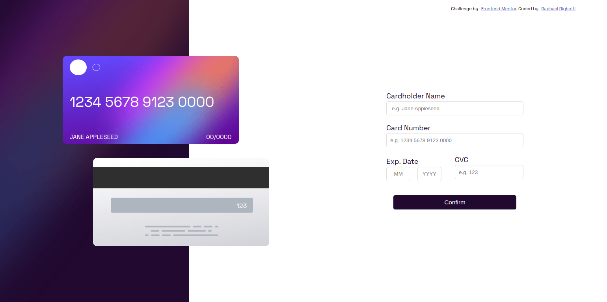

# Frontend Mentor - Interactive card details form solution

This is a solution to the [Interactive card details form challenge on Frontend Mentor](https://www.frontendmentor.io/challenges/interactive-card-details-form-XpS8cKZDWw). Frontend Mentor challenges help you improve your coding skills by building realistic projects. 

## Table of contents

- [Overview](#overview)
  - [The challenge](#the-challenge)
  - [Screenshot](#screenshot)
  - [Links](#links)
- [My process](#my-process)
  - [Built with](#built-with)
  - [What I learned](#what-i-learned)
  - [Useful resources](#useful-resources)
- [Author](#author)

## Overview

### The challenge

Users should be able to:

- Fill in the form and see the card details update in real-time
- Receive error messages when the form is submitted if:
  - Any input field is empty
  - The card number, expiry date, or CVC fields are in the wrong format
- View the optimal layout depending on their device's screen size
- See active and focus states for interactive elements on the page

### Screenshot

### Links

- Solution URL: [FrontEnd Mentor Solution](https://www.frontendmentor.io/solutions/interactive-card-details-form-vanilla-js-3VONoiBuI4)
- Live Site URL: [Live Site](https://raphaelrighetti.github.io/interactive-card-details-form-frontend-mentor/)

## My process

### Built with

- HTML5 markup
- CSS custom properties
- Flexbox
- CSS Grid
- Desktop-first workflow

### What I learned

The thing that I learned the most is how to validate forms and put what the user is typing in inputs on the screen, using regex and stuff.

### Useful resources

- [Example resource 1](https://developer.mozilla.org/) - Here's the documentation on everything I possibly have a doubt.

## Author

- Website - [Raphael Righetti](https://www.raphaelrighetti.com) (The website is not complete yet, but it will be in the future)
- Frontend Mentor - [@raphaelrighetti](https://www.frontendmentor.io/profile/raphaelrighetti)
